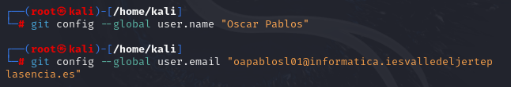

# PPS-Unidad0Actividad4-OscarPablos

 
## Enunciado

Vamos a hacer una nueva actividad con git. En esta ocasión crearemos un pequeño proyecto de una página web que podremos visualizar creando un pequeño servidor con php. Como en la actividad anterior el producto a realizar será el repositorio en github. Allí tendrás que documentar la realización de la práctica con la explicación del procedimiento, sus imágenes, etc.

## Seguimos configurando Git

Ya habrás configurado tu user y tu email con git config:

Vamos a configurar algunas cosas más.

1. Configura el editor de comandos. Yo por simplicidad utilizaría nano git config — global core.editor nano

2. Comprueba qué valor tienen las variables de configuración de git. Puedes utilizar la ayuda git config --help.

3. Ajusta los valores de las variables de Git:

        color.status=auto
        color.branch=auto
        color.interactive=auto
        color.diff=auto

Ajustamos los valores:

## Creación de Proyecto y repositorio

Para ello crea una nueva carpeta en tu directorio de git de PPS, con el nombre de esta actividad PPS-Unidad0Actividad4-TuNombre

Crea un nuevo repositorio público con nombre PPS-Unidad0Actividad4-TuNombre

Sigue las indicaciones de github para crear tu nuevo repositorio en linea de comandos, esto es:

## Iniciando Proyecto

1. Haz un listado en forma de arbol (tree -a) de todos los archivos del directorio.

2. Crea un archivo con nombre README (si no existe todavía) y lo añades al proyecto.

3. Comprueba el estado de git (git status -s o `git status --short``.

4. Escribe en él una descripción de la actividad y vuelves a comprobar su estado.

## Ignorando archivos

1. Crea una carpeta con nombre Excluded. En ella vamos a colocar la documentación que no queremos que sea rastreada y subida al repositorio.

2. Para comprobar que funciona crea algún archivo vacío allí y también crea un archivo con nombre excluido.txt en el directorio principal del repositorio.
3. Crea un archivo con nombre .gitignore en el cual vamos a poner los archivos y directorios que no queremos que se rastreen.
4. Indica en el .gitignore que los archivos con extensión .txt y el directorio Excluded no deben de ser rastreados ni sincronizados..
5. Comprueba el estado del proyecto y comprueba que no nos indica nada del seguimiento de dichos archivos.

## Trabajo con Git

Crea un archivo con nombre index.html.
Introduce el código html para que nos muestre un mensaje de Hola mundo con tu nombre. Uno sencillo sería este:
   <H1>Hola $USER¡¡¡ ¿Qué tal te encuentras?</H1>
Visualiza el estado del proyecto ( puedes hacer tambien un git status corto git status --s` o `git status --short).
Puedes ver como te indica que tienes varias operaciones por hacer: git add, git commit...
Añade el archivo index.html al proyecto (git add).
Haz un commit (Puedes hacer ``commit -am "commentario del commit"` de esta manera se añaden las modificaciones de archivos y se hace el commit con el mensaje indicado sin abrir el archivo y tener que escribir nosotros).
Vuelve a comprobar el estado del proyecto. Puedes ver como ya debería de estar todo en orden.
Vuelve a subir los cambios a tu repositorio de github (git push)
Creación de nuestro servidor web y visualización de nuestro proyecto
En un nueva pestaña de terminal y en el mismo directorio, ejecuta php -S 0:8080 para lanzar un servidor con la página html que has creado.
Visualiza la página creada Puedes acceder a ella en tu navegador en el puerto 8080 de tu equipo:
Seguimos Trabajando con Git
Haz una copia del archivo local index.html con el nombre index.html.save. Modifica el fichero index.html para que cambie el texto mostrado en la página web.
Verifica estado del proyecto.
Comprueba las diferencias de los archivos que no han sido añadidos (git diff)
Refresca navegador para comprobar que ha cambiado el contenido de nuestra página web.
Vuelve a la versión anterior del archivo index.html (git restore).
Vuelve a refrescar navegador para ver como vuelve a versión inicial.
Vamos a utiliza el comando git mv. Elimina el archivo index.html y después de hacer un commit, mueve el archivo con index.html.save a index.html
Mira el estado del proyecto y confirma todos los cambios.
Para pull y push, haz un push y comprueba cómo han subido los archivos a github.com.
Modifica el archivo index.php desde la página de github.com y haz un pull y comprueba cómo se ha modificado la página web en nuestro navegador.
